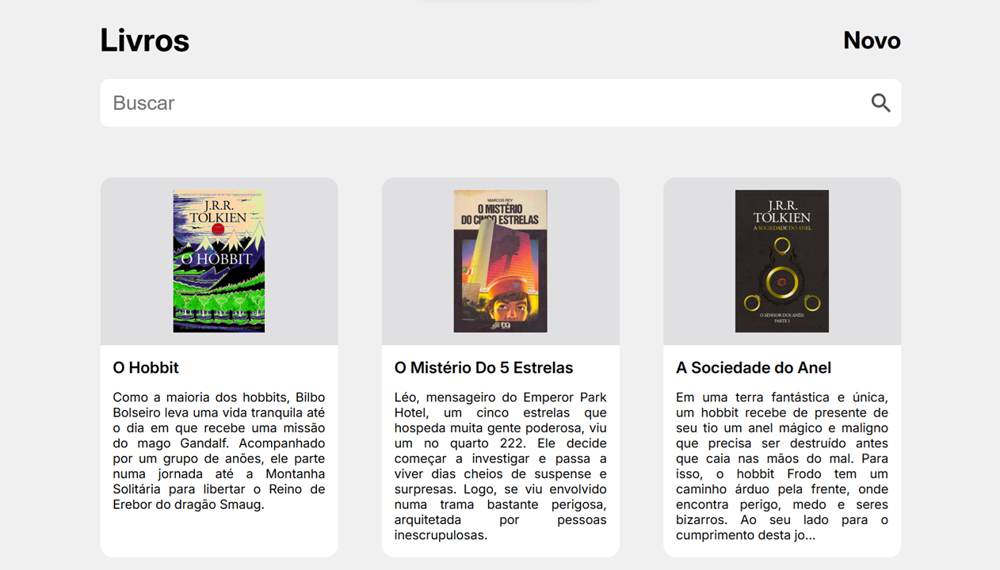
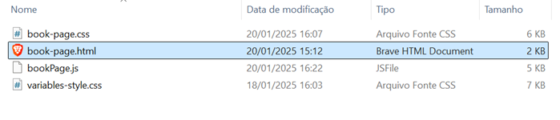

# **Books**

This is a personal study project that is a book registration application that includes the main elements necessary for a web product.

In the topics below you can see the main pillars of this application.

## **Database**

An SQLite relational database is used to manipulate application data.

The database is concentrated in a table:

- **Book**: table responsible for storing the id, title, author, publication_date, description and image of each book registered in the application.

## **Book API**

The Book API is responsible for carrying out all backend operations present in the application.

It is a Rest API with HTTP protocol capable of receiving and sending data in JSON format.

The API is divided into a main topic:

### **Book**

Responsible for processing book registration data.

Its five endpoints are as follows:


#### **GET /book**

The GET /book endpoint is responsible for listing all books registered on the database.

If the request is successful, there will be the following return:

```json
{
  "id": 0,
  "title": "string",
  "author": "string",
  "publication_date": "string",
  "description": "string",
  "image": "string"
}
```

#### **POST /book**

The POST /book endpoint is responsible for registering a new book on the database.

The following parameters must be sent to register a new book:

```json
{
  "title": "string",
  "author": "string",
  "publication_date": "string",
  "description": "string",
  "image": "string"
}
```

If the request is successful, there will be the following return:

```json
{
  "message": "Book created successfully"
}
```

#### **GET /book/{id}**

The GET /book/{id} endpoint is responsible for listing a specific book based on the id provided.

As a parameter, it is necessary to inform the **book id** through the endpoint path in the request (for example: **GET /book/1**).

If the request is successful, there will be the following return:

```json
{
  "id": 0,
  "title": "string",
  "author": "string",
  "publication_date": "string",
  "description": "string",
  "image": "string"
}
```

#### **PUT /book/{id}**

The PUT /book/{id} endpoint is responsible for updating information for a specific book.

As a parameter, it is necessary to inform the **book id** through the endpoint path in the request (for example: **PUT /book/1**).

Additionally, it is necessary to enter the following parameters in the request body.

```json
{
  "title": "string",
  "author": "string",
  "publication_date": "string",
  "description": "string",
  "image": "string"
}
```

If the request is successful, there will be the following return:

```json
{
  "message": "Book updated successfully"
}
```

#### **DELETE /book/{id}**

The DELETE /book/{id} endpoint is responsible for delete a specific book based on the id provided.

As a parameter, it is necessary to inform the **book id** through the endpoint path in the request (for example: **DELETE /book/1**).

If the request is successful, there will be the following return:

```json
{
  "message": "Book deleted successfully"
}
```

For more details about the task API, you can access the swagger documentation with the API working through the link http://localhost:3000/api-docs.

## **Frontend**

The application's frontend was developed with HTML, CSS and Vanilla JS.
You can see each of the application screens in the topics below:

### **Book page**

The book page is where the user can create and read books registered in the database.

You can access the book page through the path **/frontend/bookPage/book-page.html**.

You can see an image fo the screen itself below:




To create or update a task, the user will access the following modal:


### **Book details page**

The book details page is responsible for showing all the registration details of a specific book within the database. On this screen you can also update or delete a specific book.

You can access the login screen through the path **/frontend/bookDetailsPage/book-details.page.html**.

You can see an image fo the screen itself below:


To update a specific book, you must use the following modal below:


## **How to execute the project**

To run the project, you must have Node.js installed on the machine. If the user does not have Node.js installed, they can install it through the following link: **https://nodejs.org/en**

With Node.js installed on the machine, you need to open the project in the root folder within the CMD terminal:


With the project root folder open in CMD, you need to execute the following command:

```
npm install
```

After installing the project's dependencies with the above command, successful installation information should be displayed:


When the project dependencies are already installed, you need to execute the following command:

```
npm run dev
```

After executing the above command, the Task API will be executed:


With the Book API live, simply access the book-page.html file present in the path ./frontend/bookPage:


